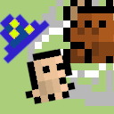
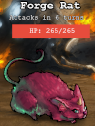

# Game Programming
[**Drowsyprof on Itch.Io** (https://drowsyprof.itch.io/)](https://drowsyprof.itch.io/)

| Title | Webpage | Source |
|-------|---------|--------|
| [Galactic Snake](#galactic-snake) | [Itch.Io](https://drowsyprof.itch.io/galactic-snake) | [GitHub](https://github.com/jeremyglebe/galactic_snake) |
| [Spire Panic](#spire-panic) | [Itch.Io](https://drowsyprof.itch.io/spire-panic) | [GitHub](https://github.com/jeremyglebe/Spire_Panic) |
| [Space RPG](#space-rpg) | [Itch.Io](https://zachkingcade.itch.io/space-rpg-beta) | [GitHub](https://github.com/zachkingcade/Space_RPG) |

## Galactic Snake

*Galactic Snake* was originally developed as part of the Midwestern State University ACM Chapter's Spring 2021 Game Jam. It was built in Phaser 3 (JavaScript) with a Firebase backend to manage authentication and the score table. I have made a few small updates since because I am very fond of the project.

## Spire Panic

A Windows-only downloadable tower-defense-like game. I wrote this for a game development class at UNT. We used a very barebones engine made by the professor, which was essentially just a wrapper to render things with DirectX. Probably the hardest game project I have made, even if it isn't the best.

## Space RPG

*Space RPG* was originally developed by a student/friend of mine for a summer class that I taught. After the assignment was completed and graded, I took an interest and helped flesh out some of the features for the project. The game is a bit like bejewled with some scary monsters and a space cowboy thrown into the mix.