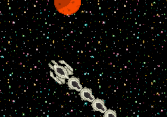

# Game Programming

| Title | Webpage | Source |
|-------|---------|--------|
| [Galactic Snake](#galactice-snake) | [Itch.Io](https://drowsyprof.itch.io/galactic-snake) | [GitHub](https://github.com/jeremyglebe/galactic_snake) |

## Galactice Snake

*Galactic Snake* was originally developed as part of the Midwestern State University ACM Chapter's Spring 2021 Game Jam. It was built in Phaser 3 (JavaScript) with a Firebase backend to manage authentication and the score table. I have made a few small updates since because I am very fond of the project.